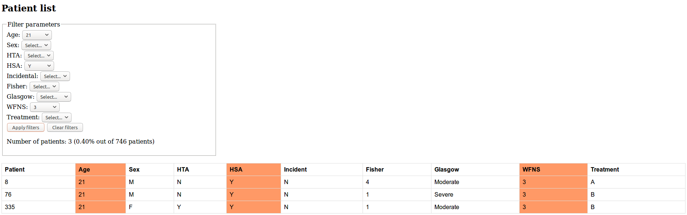

# Patient randomization tool

This repository generates a list of patients with random parameters
and implements a database interface where the results can be filtered
according to search parameters.

## Features
This tool automatically generates a given number of random patients and after every execution it outputs:
* A single "all.txt" file containing all the generated patients
* Individual \*.txt files containing columns of individual parameters - useful when porting to Excel / Matlab or other data processing tools
* A single "patients.html" file with all the generated patients' data, adapted for web browsers

## Instructions to build

Here come some instructions to build and use the patient generation tool.
### For the impatient people
Just run

`make new`

to generate new patient data or

`make int`

to generate new patient data and enter an interactive database.

### For the calm, good people
Alternatively, the executable can be built by simply typing

`make`

Then, the program shall be run like:

`./patient-generator [OPTIONS]`

, where [OPTIONS] can be any of the following:

* -h
* -i
* -M
* -m
* -n
* -v

(Note that the flag order is of no importance whatsoever - the output will still be the same!).

It is a good idea to first run the program with the '-h' flag, as in

`./patient-generator -h`

This way the available options that the program supports are shown to the user, together with some example uses.

## Example uses
Once the program is built with the `make` command, it's time to run it!
### Simplest use

`./patient-generator`

The above command will run the program at its simplest mode, i.e., it will prompt the user the following:
1. The number of patients to generate
2. The minimum age of the generated patients
3. The maximum age of the generated patients

Once having entered this data, the program will generate a given number of random patients in the specified age range and will output the results under the directory __txts__.
### Fastest use

`./patient-generator -n 100 -m 18 -M 90`

The above command will run the program and pass the following data to it:
1. 100 patients
2. Minimum age of 18
3. Maximum age of 90

This way, the user doesn't need to enter the data interactively since he/she provides that to the program from the command line.
As in the previous example, all the generated patients will end up in the directory __txts__.
### Interactive database -- 'i' flag

`./patient-generator -n 100 -m 18 -M 90 -i`

The above command will, as in the previous example, generate 100 random patients, within the ages of 18 and 90, and notice the presence of the flag 'i'. This will cause the program to enter a database where queries can be made and show patients meeting a specific search criteria.
### Incomplete input
This is the case where the user partially inputs data to the program. Imagine the following command:

`./patient-generator -m 14 -i`

*Only* the minimum age has been provided (together with the 'i' flag, which will make the program enter the interactive database after the generation). The program will still ask the user for the two remaining data in order to generate the random patients:
* The maximum age
* The number of patients to generate

## Bugs, improvements & more
Any bugs, improvements or flaws are happily accepted, I will try to correct them as soon as possible.

## TODO & Future work
* Add information of the use of the database when running in interactive mode. In the meantime, run `help` when inside the database to show all available options and general use.
* ~~Output an html document where the results can be seen in a web browser~~ Done.
* Make it graphical in order to ease up people's lives and 'save' them from the beauty of the terminal ...
